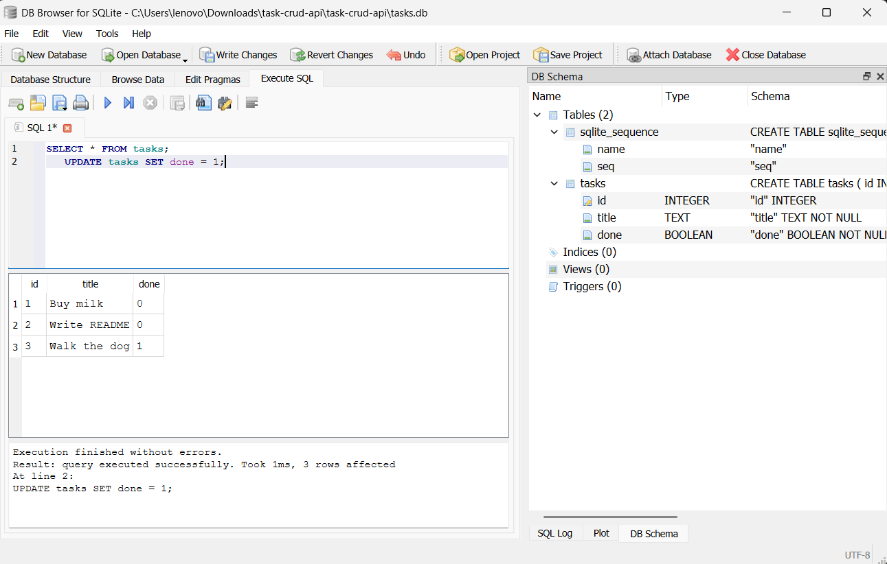

# Task CRUD API


A to-do list API demonstrating the four CRUD operations (**C**reate, **R**ead, **U**pdate, **D**elete), backed by a real SQLite database — data now survives server restarts.

---

## Table of Contents

- [Overview](#overview)
- [Tech Stack](#tech-stack)
- [Getting Started](#getting-started)
- [API Reference](#api-reference)
- [Example Usage](#example-usage)
- [Error Format](#error-format)
- [Database](#database)
- [Interactive Docs (Swagger UI)](#interactive-docs-swagger-ui)
- [Roadmap](#roadmap)
- [License](#license)

---

## Overview

This API manages a to-do list. Every task is stored as a row in a SQLite database:

```json
{ "id": 1, "title": "Buy milk", "done": false }
```

The API surface is identical to the original in-memory version — same URLs, same request bodies, same status codes. Only the storage layer changed, which is the whole point: **the API describes what the app does; the database describes where it keeps its data.**

## Tech Stack

| Layer            | Choice                                    |
|-------------------|--------------------------------------------|
| Language          | Python 3.10+                              |
| Framework         | [FastAPI](https://fastapi.tiangolo.com/)  |
| Server            | Uvicorn                                   |
| Docs              | Swagger UI (auto-generated at `/docs`)    |
| Database          | SQLite (via Python's built-in `sqlite3`)  |
| Storage file      | `tasks.db` (created automatically)        |

## Getting Started

### Prerequisites

- Python 3.10 or later installed and on your `PATH`
- No database installation needed — SQLite ships with Python

### Installation

**macOS / Linux:**

```bash
python3 -m venv venv
source venv/bin/activate
pip install fastapi "uvicorn[standard]"
```

**Windows (PowerShell):**

```powershell
python -m venv venv
.\venv\Scripts\Activate.ps1
python -m pip install fastapi "uvicorn[standard]"
```

### Run the server

```bash
uvicorn main:app --reload --port 8000
```

> Windows users: if `uvicorn` isn't recognized as a command, run `python -m uvicorn main:app --reload --port 8000` instead.

On first run, `tasks.db` is created automatically in the project folder, the `tasks` table is created, and 3 example tasks are inserted. On every run after that, the existing data is reused — nothing is re-seeded.

Once running, open:

| URL                              | What you'll see          |
|-----------------------------------|---------------------------|
| http://localhost:8000/            | API info                  |
| http://localhost:8000/health      | Health check              |
| http://localhost:8000/docs        | Interactive Swagger UI    |

## API Reference

| Method   | Path            | Description                          | Success | Errors     |
|----------|-----------------|----------------------------------------|---------|------------|
| `GET`    | `/`             | API info                              | `200`   | —          |
| `GET`    | `/health`       | Health check                          | `200`   | —          |
| `GET`    | `/tasks`        | List all tasks                        | `200`   | —          |
| `GET`    | `/tasks/{id}`   | Get a single task                     | `200`   | `404`      |
| `POST`   | `/tasks`        | Create a task (`title` required)      | `201`   | `400`      |
| `PUT`    | `/tasks/{id}`   | Update a task's `title` and/or `done` | `200`   | `400`, `404` |
| `DELETE` | `/tasks/{id}`   | Delete a task                         | `204`   | `404`      |

## Example Usage

**Create a task**

```bash
curl -i -X POST http://localhost:8000/tasks \
  -H "Content-Type: application/json" \
  -d '{"title":"Buy milk"}'
```

```http
HTTP/1.1 201 Created
content-type: application/json

{"id":4,"title":"Buy milk","done":false}
```

**Mark it done**

```bash
curl -i -X PUT http://localhost:8000/tasks/4 \
  -H "Content-Type: application/json" \
  -d '{"done":true}'
```

**Delete it**

```bash
curl -i -X DELETE http://localhost:8000/tasks/4
```

```http
HTTP/1.1 204 No Content
```

**Restart the server and check again** — task 4 is still there. That's the whole upgrade from Assignment 1.

## Error Format

Every error returns a JSON body with a single `error` key:

```json
{ "error": "Task 99 not found" }
```

| Status | Meaning         | When it happens                      |
|--------|-----------------|----------------------------------------|
| `400`  | Bad Request     | Missing or empty `title` on create/update |
| `404`  | Not Found       | No task exists with that `id`         |

## Database

**Why SQLite?** It requires no separate server or installation, stores everything in a single file, and is built into Python's standard library (`sqlite3`) — perfect for a small project like this while still being real SQL.

**Where it's stored:** `tasks.db`, in the project root, next to `main.py`. It's created automatically the first time you run the server and is excluded from git via `.gitignore` (each developer gets their own local copy with fresh seed data).

**Schema:**

```sql
CREATE TABLE IF NOT EXISTS tasks (
    id INTEGER PRIMARY KEY AUTOINCREMENT,
    title TEXT NOT NULL,
    done BOOLEAN NOT NULL DEFAULT 0
);
```

**Exploring it manually:** open `tasks.db` with [DB Browser for SQLite](https://sqlitebrowser.org/) and run queries directly against it. Example — marking every task complete:

```sql
UPDATE tasks SET done = 1;
```

Refreshing `GET /tasks` immediately shows the change — proof the API is reading live from the database, not from any cached copy.



## Interactive Docs (Swagger UI)

FastAPI generates a full interactive spec automatically — no extra setup required.


Every endpoint above is listed with a **Try it out** button that sends real requests and shows real responses, directly in the browser.

## Roadmap

- [ ] Filtering via query parameters (`?done=true`, `?search=milk` using SQL `LIKE`)
- [ ] Pagination (`?limit=2&offset=2`)
- [ ] `/stats` endpoint using SQL `COUNT()`
- [ ] `created_at` / `updated_at` timestamps

## License

MIT.