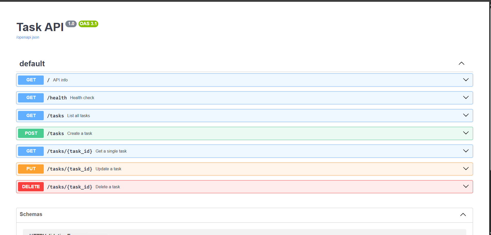

# Task CRUD API


A small, fast, in-memory to-do list API — built to demonstrate the four CRUD operations (**C**reate, **R**ead, **U**pdate, **D**elete) as a clean REST interface, with interactive Swagger docs included for free.

---

## Table of Contents

- [Overview](#overview)
- [Tech Stack](#tech-stack)
- [Getting Started](#getting-started)
- [API Reference](#api-reference)
- [Example Usage](#example-usage)
- [Error Format](#error-format)
- [Interactive Docs (Swagger UI)](#interactive-docs-swagger-ui)
- [The Mortality Experiment](#the-mortality-experiment)
- [Roadmap](#roadmap)
- [License](#license)

---

## Overview

This API manages a to-do list. Data lives entirely **in memory** — there is intentionally no database yet. Every task is a simple object:

```json
{ "id": 1, "title": "Buy milk", "done": false }
```

Restarting the server clears all data back to the seed tasks. That's a feature of this stage, not a bug — see [The Mortality Experiment](#the-mortality-experiment) below.

## Tech Stack

| Layer            | Choice                          |
|-------------------|----------------------------------|
| Language          | Python 3.10+                    |
| Framework         | [FastAPI](https://fastapi.tiangolo.com/) |
| Server            | Uvicorn                         |
| Docs              | Swagger UI (auto-generated at `/docs`) |
| Storage           | In-memory Python list (no DB)   |

## Getting Started

### Prerequisites

- Python 3.10 or later installed and on your `PATH`

### Installation

**macOS / Linux:**

```bash
python3 -m venv venv
source venv/bin/activate
pip install fastapi "uvicorn[standard]"
```

**Windows (PowerShell):**

```powershell
python -m venv venv
.\venv\Scripts\Activate.ps1
python -m pip install fastapi "uvicorn[standard]"
```

### Run the server

```bash
uvicorn main:app --reload --port 8000
```

> Windows users: if `uvicorn` isn't recognized as a command, run `python -m uvicorn main:app --reload --port 8000` instead.

Once running, open:

| URL                              | What you'll see          |
|-----------------------------------|---------------------------|
| http://localhost:8000/            | API info                  |
| http://localhost:8000/health      | Health check              |
| http://localhost:8000/docs        | Interactive Swagger UI    |

## API Reference

| Method   | Path            | Description                          | Success | Errors     |
|----------|-----------------|----------------------------------------|---------|------------|
| `GET`    | `/`             | API info                              | `200`   | —          |
| `GET`    | `/health`       | Health check                          | `200`   | —          |
| `GET`    | `/tasks`        | List all tasks                        | `200`   | —          |
| `GET`    | `/tasks/{id}`   | Get a single task                     | `200`   | `404`      |
| `POST`   | `/tasks`        | Create a task (`title` required)      | `201`   | `400`      |
| `PUT`    | `/tasks/{id}`   | Update a task's `title` and/or `done` | `200`   | `400`, `404` |
| `DELETE` | `/tasks/{id}`   | Delete a task                         | `204`   | `404`      |

## Example Usage

**Create a task**

```bash
curl -i -X POST http://localhost:8000/tasks \
  -H "Content-Type: application/json" \
  -d '{"title":"Buy milk"}'
```

```http
HTTP/1.1 201 Created
content-type: application/json

{"id":4,"title":"Buy milk","done":false}
```

**Mark it done**

```bash
curl -i -X PUT http://localhost:8000/tasks/4 \
  -H "Content-Type: application/json" \
  -d '{"done":true}'
```

**Delete it**

```bash
curl -i -X DELETE http://localhost:8000/tasks/4
```

```http
HTTP/1.1 204 No Content
```

## Error Format

Every error returns a JSON body with a single `error` key, so clients never have to guess the shape:

```json
{ "error": "Task 99 not found" }
```

| Status | Meaning         | When it happens                      |
|--------|-----------------|----------------------------------------|
| `400`  | Bad Request     | Missing or empty `title` on create/update |
| `404`  | Not Found       | No task exists with that `id`         |

## Interactive Docs (Swagger UI)

FastAPI generates a full interactive spec automatically — no extra setup required.



Every endpoint above is listed with a **Try it out** button that sends real requests and shows real responses, directly in the browser.

## The Mortality Experiment

I created a few tasks, restarted the server, then called `GET /tasks` again. Every task I'd added was gone — only the original 3 seed tasks remained.

This happens because the task list is just a Python variable living in the server process's memory; nothing is written to disk, so restarting the process wipes it clean. This is exactly the problem a database solves, which is why it's next on the list.

## Roadmap

- [ ] Persist tasks to a real database (SQLite / Postgres)
- [ ] Filtering via query parameters (`?done=true`, `?search=milk`)
- [ ] Pagination (`?limit=2&offset=2`)
- [ ] `/stats` endpoint for task counts

## License

MIT — do whatever you want with it, just don't blame me if your to-do list forgets itself on restart. (See [The Mortality Experiment](#the-mortality-experiment).)